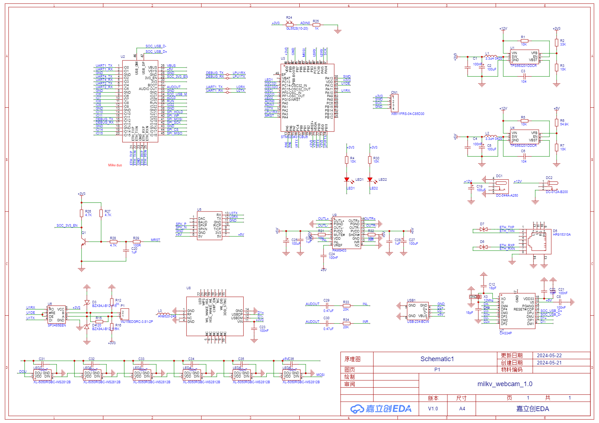
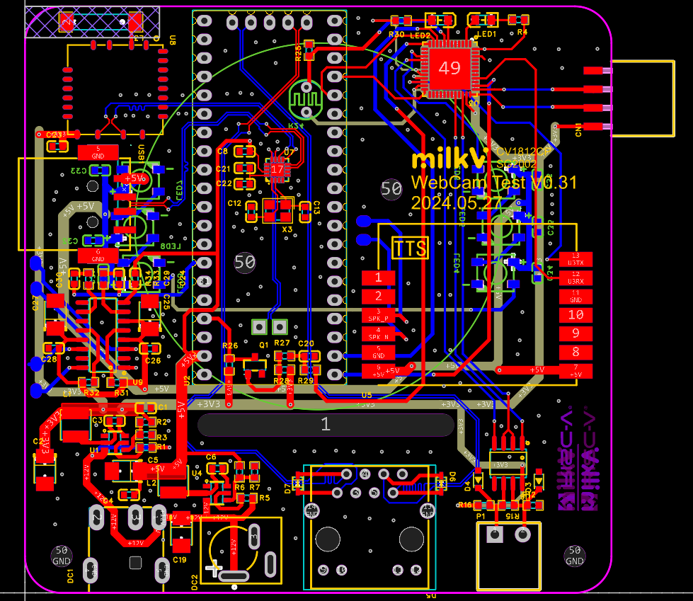
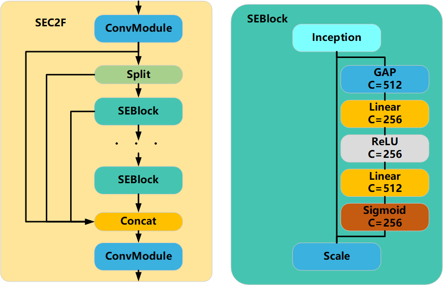
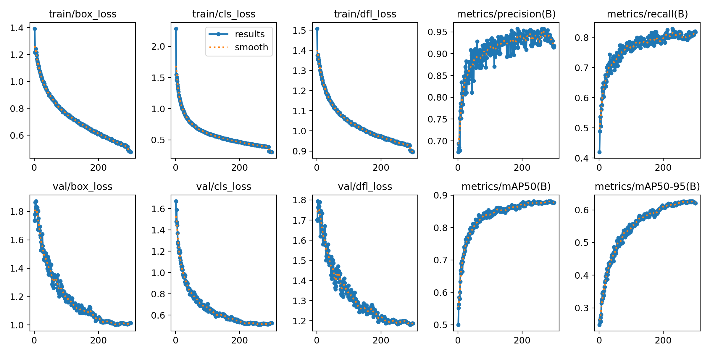

# SG2002违章检测系统技术文档

## 1 电路硬件实现

电路硬件主要包括MilkV Duo 256M开发板、摄像头、音频功放模块、LED模块、以及电源相关电路。

使用嘉立创EDA绘制原理图以及PCB文件后，在嘉立创进行打样制作。

工程文件已开源至 https://oshwhub.com/holydeal/milkv_webcam_1-0

## 2 硬件程序
硬件程序使用算能TDL框架，目标检测模型使用SEBlock改进C2F模块的YOLOv8s模型，DeepSORT目标追踪算法，以及自行设计的违章检测算法。

该模型在本作品使用的数据集上与YOLOv8s以及v5s性能对比如下，训练参数为300epoch 4batch,数据集为开源数据集https://www.kaggle.com/datasets/snehilsanyal/construction-site-safety-image-dataset-roboflow/data

|模型名称|YOLO v5s原版|YOLO v8s原版|YOLO v8s SEC2F|
|----|----|----|----|
|参数量|9.6M|11.2M|11.13M|
|mAP50|0.757|0.822|0.881|
|mAP95|0.435|0.521|0.627|

## 3 上位机实现
上位机使用Python+Qt5框架进行编写，与硬件设备之间使用UDP进行局域网通讯。
